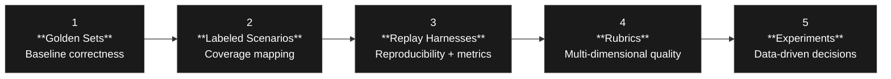

Gauntlet

# Evals That Actually Work
A 5-Stage Framework for Production AI Quality

[←] [→] navigate 01 / 39

Gauntlet

# "How do you know your AI is good?"

> If your answer is **"we tested it manually"** or **"it looked fine in review"** — you don't have an eval strategy.

← → navigate 02 / 39

Gauntlet

— THE PROBLEM

# Without evals, you're flying blind

<table>
  <tbody>
    <tr>
        <td>Without Evals</td>
        <td>With Evals</td>
    </tr>
    <tr>
        <td>* Guess if changes helped</td>
        <td>* Measure if changes helped</td>
    </tr>
    <tr>
        <td>* Find regressions in production</td>
        <td>* Catch regressions before shipping</td>
    </tr>
    <tr>
        <td>* Debate quality subjectively</td>
        <td>* Compare quality with data</td>
    </tr>
    <tr>
        <td>* Ship and hope</td>
        <td>* Ship and know</td>
    </tr>
  </tbody>
</table>

← → navigate 03 / 39

Gauntlet

— THE FRAMEWORK

# Five stages, each building on the last



Start at Stage 1. Add stages as your system matures.

← → navigate 04 / 39

Gauntlet

Five stages, each building on the last

STAGE 01

# Golden Sets

*Your first line of defense*

<table>
  <tbody>
    <tr>
        <td>Golden Sets</td>
        <td>Labeled Scenarios</td>
        <td>Replay Harnesses</td>
        <td>Rubrics</td>
        <td>Experiments</td>
    </tr>
    <tr>
        <td>Your first line of defense</td>
        <td>[hidden text]</td>
        <td>[hidden text]</td>
        <td>[hidden text]</td>
        <td>[hidden text]</td>
    </tr>
  </tbody>
</table>

Start with Stage 1. Add stages as your system matures.

← → navigate 05 / 39

Gauntlet

GOLDEN SETS

# Golden sets define what "correct" looks like

Small (10–20 cases). Fast to run. If these fail, something is fundamentally broken.

```yaml
GOLDEN_DATA.YAML

- id: "gs-001"
  query: "What is our remote work policy?"

  expected_tools:
    - vector_search

  expected_sources:
    - remote_work_policy.md

  must_contain:
    - "remote"
    - "core hours"

  must_not_contain:
    - "I don't know"
    - "no information"
```

← → navigate 06 / 39

Gauntlet

— GOLDEN SETS

# Golden sets use four types of checks

<table>
  <tbody>
    <tr>
        <td>CHECK</td>
        <td>WHAT IT CATCHES</td>
    </tr>
    <tr>
        <th>Tool selection</th>
        <th>Agent used the wrong tool</th>
    </tr>
    <tr>
        <th>Source citation</th>
        <th>Agent cited the wrong document</th>
    </tr>
    <tr>
        <th>Content validation</th>
        <th>Response is missing key facts</th>
    </tr>
    <tr>
        <th>Negative validation</th>
        <th>Agent hallucinated or gave up</th>
    </tr>
  </tbody>
</table>

> These are **code evals** — deterministic, binary, no LLM needed.

← → navigate 07 / 39

Gauntlet

GOLDEN SETS

# Deterministic checks beat probabilistic judges

```python
EVALUATOR.PY

# Tool selection
assert "vector_search" in actual_tools          # ✓ or ✗

# Source citation
assert "refund_policy.md" in response_text      # ✓ or ✗

# Content validation
assert "30-day" in response_text                # ✓ or ✗
assert "$500" in response_text                  # ✓ or ✗

# Negative validation
assert "I don't know" not in response_text      # ✓ or ✗
```

Zero API cost. Zero ambiguity. Run after every commit.

← → navigate 08 / 39

Gauntlet

--- GOLDEN SETS

# Four rules for golden sets that stay useful

<table>
  <tbody>
    <tr>
        <td>Start small</td>
        <td>10–20 quality cases beats 100 sloppy ones</td>
    </tr>
    <tr>
        <td>Run on every commit</td>
        <td>These are your regression tests</td>
    </tr>
    <tr>
        <td>Add from production bugs</td>
        <td>Every bug becomes a test case</td>
    </tr>
    <tr>
        <td>Never</td>
        <td>Change expected output just to make tests pass</td>
    </tr>
  </tbody>
</table>

← → navigate 09 / 39

Gauntlet

~~r rules for golden sets that stay useful~~

STAGE 02

# Labeled Scenarios

*Coverage mapping*

~~from production bugs~~

← → navigate 10 / 39

Gauntlet

LABELED SCENARIOS

# Labeled scenarios are golden set cases with tags

SCENARIOS.YAML
```yaml
- id: "sc-m-001"
  query: "What's our refund policy and how many refunds last quarter?"
  expected_tools: ["vector_search", "sql_query"]
  category:      multi_tool
  subcategory: vector_and_sql
  difficulty: straightforward
```

> The tags don't change how the test runs — **they change what the results tell you.**

← → navigate 11 / 39

Gauntlet

LABELED SCENARIOS

# Organize by category — empty cells show you where to write tests next

<table>
  <thead>
    <tr>
        <th></th>
        <th>vector</th>
        <th>sql</th>
        <th>jira</th>
        <th>slack</th>
        <th>multi</th>
    </tr>
  </thead>
  <tbody>
    <tr>
        <td>straightforward</td>
        <td>3/3</td>
        <td>2/3</td>
        <td>2/2</td>
        <td>2/2</td>
        <td>1/1</td>
    </tr>
    <tr>
        <td>ambiguous</td>
        <td>1/1</td>
        <td>1/2</td>
        <td>0/1</td>
        <td>1/1</td>
        <td>0/1</td>
    </tr>
    <tr>
        <td>edge_case</td>
        <td>1/1</td>
        <td>1/1</td>
        <td>1/1</td>
        <td>--</td>
        <td>--</td>
    </tr>
  </tbody>
</table>

← → navigate 12 / 39

Gauntlet

LABELED SCENARIOS

# Golden sets and labeled scenarios answer different questions

> Golden Sets: "Does it work?" $\rightarrow$ correctness
> Labeled Scenarios: "Does it work for all types?" $\rightarrow$ coverage

<table>
  <thead>
    <tr>
        <th></th>
        <th>GOLDEN SETS</th>
        <th>LABELED SCENARIOS</th>
    </tr>
  </thead>
  <tbody>
    <tr>
        <td>Size</td>
        <td>10–20</td>
        <td>30–100+</td>
    </tr>
    <tr>
        <td>All must pass?</td>
        <td>Yes</td>
        <td>No</td>
    </tr>
    <tr>
        <td>When to run</td>
        <td>Every commit</td>
        <td>Every release</td>
    </tr>
  </tbody>
</table>

← → navigate 13 / 39

Gauntlet

Golden sets and labeled scenarios answer different questions

STAGE 03
# Replay Harnesses
*Reproducibility + rich metrics*

<table>
  <thead>
    <tr>
        <th></th>
        <th>GOLDEN SETS</th>
        <th>LABELED SCENARIOS</th>
    </tr>
  </thead>
  <tbody>
    <tr>
        <td>Does it work?</td>
        <td>→ correctness</td>
        <td></td>
    </tr>
    <tr>
        <td>Does it work for all types?</td>
        <td>→ coverage</td>
        <td></td>
    </tr>
    <tr>
        <td>Count</td>
        <td>10-20</td>
        <td>30-100+</td>
    </tr>
    <tr>
        <td>Manual Review</td>
        <td>Yes</td>
        <td>No</td>
    </tr>
    <tr>
        <td>Frequency</td>
        <td>Every commit</td>
        <td>Every release</td>
    </tr>
  </tbody>
</table>

← → navigate 14 / 39

Gauntlet

REPLAY HARNESSES

# Record once. Score anytime.

Capture a real session to a JSON fixture. Evaluate that frozen snapshot whenever you want — immediately, next week, or after a human has annotated ground truth.

```python
RECORDER.PY / PLAYER.PY

# Record once (costs tokens)
session = record_session(
    query="What's our refund policy and how many refunds in Q4?",
    session_id="refund-001"
)
# → saves to fixtures/refund-001.json

# Replay forever (costs nothing)
replayed = replay_session("refund-001")
scores = evaluate_session(replayed)
```

**Record production examples.** Real queries make the best test cases.

← → navigate 15 / 39

Gauntlet

REPLAY HARNESSES

# Stage 3 introduces ML-grade metrics

<table>
  <thead>
    <tr>
        <th>METRIC</th>
        <th>WHAT IT MEASURES</th>
    </tr>
  </thead>
  <tbody>
    <tr>
        <td>Precision</td>
        <td>How many retrieved docs are relevant?</td>
    </tr>
    <tr>
        <td>Recall</td>
        <td>How many relevant docs were retrieved?</td>
    </tr>
    <tr>
        <td>Groundedness</td>
        <td>Is the response grounded in sources?</td>
    </tr>
    <tr>
        <td>Faithfulness</td>
        <td>Does it stay true to sources (no hallucination)?</td>
    </tr>
    <tr>
        <td>Tool Accuracy</td>
        <td>Did it use the correct tools?</td>
    </tr>
  </tbody>
</table>

> Groundedness and faithfulness require an LLM judge — which we'll cover next.

← → navigate 16 / 39

Gauntlet

# 3 introduces ML-grade metrics

LLM AS A JUDGE
# Use it right, or don't use it

WHAT IT MEASURES

* How many retrieved docs are relevant?
* How many relevant docs were retrieved?
* Is the response grounded in sources?
* Does it stay true to sources (no hallucination)?
* Did it use the correct tools?

Faithfulness require an LLM judge — which we'll cover next.

← → navigate 17 / 39

Gauntlet

LLM AS A JUDGE

# The judge checks claims against sources

```
# Is this claim supported by the source?

claim:  "We offer 30-day refunds"
source: refund_policy.md → "...30-day refund window..."
result: ✓ grounded

claim:  "We offer 60-day refunds"
source: refund_policy.md → "...30-day refund window..."
result: ✗ not grounded (hallucination)
```

The judge makes a binary call per claim, then aggregates into a groundedness score.

← → navigate 18 / 39

Gauntlet

LLM AS A JUDGE

# Calibrate before you ship the judge

```python
CALIBRATION.PY

# Step 1: Score 20 examples by hand
human_scores = [4, 3, 5, 2, 5, 4, 3, ...]

# Step 2: Run the LLM judge on the same examples
llm_scores   = [4, 4, 5, 3, 5, 3, 3, ...]

# Step 3: Check correlation
correlation(human_scores, llm_scores)
# If < 0.8, your rubric is broken - fix it before trusting the judge
```

> A judge with a bad rubric produces **confident, wrong scores.**

← → navigate 19 / 39

Gauntlet

LLM AS A JUDGE

# LLM judges fail when criteria are vague

<table>
  <thead>
    <tr>
        <th>❌ VAGUE</th>
        <th>✓ SPECIFIC</th>
    </tr>
  </thead>
  <tbody>
    <tr>
        <td>Response is helpful</td>
        <td>User could act on this without follow-up</td>
    </tr>
    <tr>
        <td>Demonstrates strategic thinking</td>
        <td>Identifies ≥2 trade-offs with concrete examples</td>
    </tr>
    <tr>
        <td>Good quality</td>
        <td>All facts verifiable from cited sources</td>
    </tr>
  </tbody>
</table>

If you can't describe what 5/5 looks like in concrete terms, the judge can't score it — and neither can a human.

← → navigate 20 / 39

Gauntlet

judges fail when criteria are vague

STAGE 04
# Rubrics
*How good, not just whether it passed*

> LLMs can't guess what 5/5 looks like in concrete terms,
> and neither can a human.

SPECIFIC
* "User could act on this without follow-up"
* "Identifies > 2 trade-offs with concrete examples"
* "All facts verifiable from cited sources"

← → navigate 21 / 39

Gauntlet

RUBRICS

# Rubrics score across four weighted dimensions

<table>
  <thead>
    <tr>
        <th>DIMENSION</th>
        <th>WEIGHT</th>
        <th>QUESTION</th>
    </tr>
  </thead>
  <tbody>
    <tr>
        <td>Relevance</td>
        <td>30%</td>
        <td>Does it address the question?</td>
    </tr>
    <tr>
        <td>Accuracy</td>
        <td>40%</td>
        <td>Are the facts correct?</td>
    </tr>
    <tr>
        <td>Completeness</td>
        <td>20%</td>
        <td>Does it fully answer?</td>
    </tr>
    <tr>
        <td>Clarity</td>
        <td>10%</td>
        <td>Is it easy to understand?</td>
    </tr>
  </tbody>
</table>

Weighted average $\rightarrow$ single quality score. Track trends. A 5% drop in accuracy is a red flag.

$\leftarrow$ $\rightarrow$ navigate 22 / 39

Gauntlet

RUBRICS

# Every score needs an explicit anchor

```yaml
RUBRICS.YAML

accuracy:
  weight: 0.4
  scores:
    5: "All facts correct and verifiable from cited sources"
    3: "Mostly correct with one minor inaccuracy"
    1: "Contains significant errors or misleading information"
    0: "Completely incorrect or fabricated"
```

> No anchor = no consistency. A judge that interprets "3" differently each run is useless.

← → navigate 23 / 39

Gauntlet

RUBRICS

# Score thresholds tell you what action to take

<table>
  <thead>
    <tr>
        <th>SCORE</th>
        <th>QUALITY</th>
        <th>ACTION</th>
    </tr>
  </thead>
  <tbody>
    <tr>
        <td>4.5–5.0</td>
        <td>Excellent</td>
        <td>Ship it</td>
    </tr>
    <tr>
        <td>3.5–4.4</td>
        <td>Good</td>
        <td>Minor tweaks</td>
    </tr>
    <tr>
        <td>2.5–3.4</td>
        <td>Acceptable</td>
        <td>Review and improve</td>
    </tr>
    <tr>
        <td>1.5–2.4</td>
        <td>Poor</td>
        <td>Significant work needed</td>
    </tr>
    <tr>
        <td>0–1.4</td>
        <td>Critical</td>
        <td>Stop. Fix now.</td>
    </tr>
  </tbody>
</table>

navigate 24 / 39

Gauntlet

These thresholds tell you what action to take

STAGE 05
# Experiments
*Make decisions with data*

<table>
  <tbody>
    <tr>
        <td>QUALITY</td>
        <td>ACTION</td>
    </tr>
    <tr>
        <td>Excellent</td>
        <td>Ship it</td>
    </tr>
    <tr>
        <td>Good</td>
        <td>Minor tweaks</td>
    </tr>
    <tr>
        <td>Acceptable</td>
        <td>Review and improve</td>
    </tr>
    <tr>
        <td>Poor</td>
        <td>Significant work needed</td>
    </tr>
    <tr>
        <td>Critical</td>
        <td>Stop. Fix now.</td>
    </tr>
  </tbody>
</table>

← → navigate 25 / 39

Gauntlet

EXPERIMENTS

# Experiments replace intuition with evidence

<table>
  <thead>
    <tr>
        <th>Variant</th>
        <th>Pass %</th>
        <th>Rubric</th>
        <th>Latency</th>
        <th>Cost</th>
    </tr>
  </thead>
  <tbody>
    <tr>
        <td>baseline</td>
        <td>87%</td>
        <td>4.1/5</td>
        <td>1.2s</td>
        <td>$0.003</td>
    </tr>
    <tr>
        <td>gpt-4o</td>
        <td>93%</td>
        <td>4.5/5</td>
        <td>2.1s</td>
        <td>$0.015</td>
    </tr>
    <tr>
        <td>new_prompt</td>
        <td>91%</td>
        <td>4.3/5</td>
        <td>1.3s</td>
        <td>$0.003</td>
    </tr>
  </tbody>
</table>

`new_prompt` gets 91% of gpt-4o quality at 20% of the cost. That's a data-driven decision.

← → navigate 26 / 39

Gauntlet

EXPERIMENTS

# One variable at a time

<table>
  <tbody>
    <tr>
        <td>One change per experiment</td>
        <td>Isolate variables to understand impact</td>
    </tr>
    <tr>
        <td>Same test set every time</td>
        <td>Apples to apples</td>
    </tr>
    <tr>
        <td>Track cost</td>
        <td>6% quality gain at 5× cost may not be worth it</td>
    </tr>
    <tr>
        <td>Version your prompts</td>
        <td>Store them as files; commit to git</td>
    </tr>
  </tbody>
</table>

← → navigate 27 / 39

Gauntlet

WHAT NOT TO DO

# The three eval anti-patterns

← → navigate 28 / 39

Gauntlet

— ANTI-PATTERN 1

# The Likert trap

> "Rate the quality of this response: 1 (poor) to 5 (excellent)"

<table>
  <tbody>
    <tr>
        <td>What happens</td>
        <td>Human A gives "3" for adequate answers. Human B gives "4". Aggregated scores are noise, not signal.</td>
    </tr>
    <tr>
        <td>Fix</td>
        <td>Define every point on the scale. If you can't write the anchor, you haven't done the work.</td>
    </tr>
  </tbody>
</table>

← → navigate 29 / 39

Gauntlet

ANTI-PATTERN 2

# Vague criteria

> "The response demonstrates strategic thinking"

<table>
  <tbody>
    <tr>
        <td>Problems</td>
        <td>Strategic thinking is undefined. Two evaluators will score differently. An LLM judge will hallucinate a definition. You can't tell what improvement looks like.</td>
    </tr>
    <tr>
        <td>Fix</td>
        <td>Make it falsifiable: "Response identifies ≥2 explicit trade-offs with concrete examples"</td>
    </tr>
  </tbody>
</table>

← → navigate 30 / 39

Gauntlet

ANTI-PATTERN 3

# Ambiguous ranges

> "The response length should be between 300 and 500 tokens"

<table>
  <tbody>
    <tr>
        <td>Problem</td>
        <td>A 450-token response that misses the question passes. A 250-token response that perfectly answers it fails. This criterion measures form, not quality.</td>
    </tr>
    <tr>
        <td>Fix</td>
        <td>Describe what good looks like: "Answers all parts of the question; does not include unrequested information"</td>
    </tr>
  </tbody>
</table>

← → navigate 31 / 39

Gauntlet

— ANTI-PATTERNS

# They all describe form, not quality

> Length, scale labels, and vague terms are **proxies** for quality — not quality itself.

**The rule:** A criterion is done when you can write a concrete example that unambiguously passes and one that unambiguously fails.

If you can't do that, keep writing.

← → navigate 32 / 39

Gauntlet

GOOD PRACTICES

# The opinionated version

← → navigate 33 / 39

Gauntlet

GOOD PRACTICES

# Use binary checks where you can

```python
# EVALUATOR.PY

# Specific. Deterministic. Fast.
assert "vector_search" in actual_tools
assert "refund_policy.md" in response
assert "I don't know" not in response
assert "$500 annual stipend" in response
```

Binary checks have zero calibration cost, zero API cost, and produce the same result every run.

> Reserve LLM judges for what can't be checked programmatically.

← → navigate 34 / 39

Gauntlet

— GOOD PRACTICES

# Write rubric anchors before you run any evals

<table>
  <tbody>
    <tr>
        <td>STEP</td>
        <td>WHY</td>
    </tr>
    <tr>
        <th>1. Write score anchors (0, 3, 5 minimum)</th>
        <th>Forces you to define quality</th>
    </tr>
    <tr>
        <th>2. Score 20 examples by hand</th>
        <th>Creates ground truth</th>
    </tr>
    <tr>
        <th>3. Run LLM judge on same examples</th>
        <th>Measures calibration</th>
    </tr>
    <tr>
        <th>4. Adjust until correlation ≥ 0.8</th>
        <th>Validates the judge</th>
    </tr>
    <tr>
        <th>5. Then run at scale</th>
        <th>Now you can trust it</th>
    </tr>
  </tbody>
</table>

← → navigate 35 / 39

Gauntlet

— GOOD PRACTICES

# Match the eval to the moment

<table>
  <tbody>
    <tr>
        <td>Every commit</td>
        <td>→ Golden sets</td>
        <td>(5 min, catch regressions)</td>
    </tr>
    <tr>
        <td>Every release</td>
        <td>→ Labeled scenarios</td>
        <td>(coverage check)</td>
    </tr>
    <tr>
        <td>Weekly</td>
        <td>→ Replay harnesses</td>
        <td>(deep quality analysis)</td>
    </tr>
    <tr>
        <td>Before shipping</td>
        <td>→ Rubric evals</td>
        <td>(multi-dimensional scoring)</td>
    </tr>
    <tr>
        <td>On any change</td>
        <td>→ Experiment</td>
        <td>(validate the hypothesis)</td>
    </tr>
  </tbody>
</table>

The earlier you catch a regression, the cheaper it is to fix.

← → navigate 36 / 39

Gauntlet

GOOD PRACTICES

# Build your eval stack in six steps

1. **Write 10–15 golden cases today**
   Tools, sources, content checks, negative validation

2. **Label them by query type and difficulty**
   Category, subcategory, complexity

3. **Record real production sessions as fixtures**
   Real queries make the best test cases

4. **Define rubrics with explicit anchors**
   Every score point needs a concrete description

5. **Calibrate your LLM judge against human scores**
   Target correlation $\ge 0.8$ before running at scale

6. **A/B test every meaningful change**
   One variable at a time

← → navigate 37 / 39

Gauntlet

--- THE GOAL

# Make "is this better?" a question you answer with data

> Before: "I think the new prompt is better, it felt more accurate"
>
> After: "The new prompt scored 4.3/5 vs 4.1/5 on accuracy,
> passed 91% of golden cases vs 87%,
> with no change in latency or cost"

That's the difference between guessing and shipping with confidence.

← → navigate 38 / 39

Gauntlet

# Start at Stage 1

10–15 golden cases, run after every commit. Add stages as your system matures.

← → navigate 39 / 39